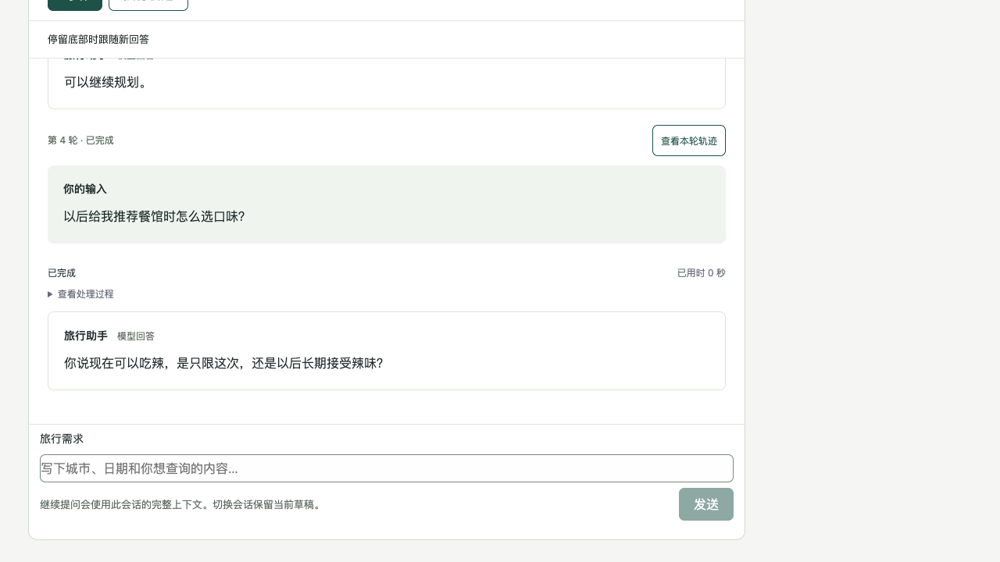

# 旅行者偏好记忆验收（规格 #27）

## 验收边界

2026-10-10，公开 HTTP 为主要验收入口；真实应用生命周期、后台调度和临时 SQLite 组合运行。时间和外部模型是已经确认的资源边界，确定性测试只替换外部模型，不调用私有后台方法。浏览器使用正式构建页面与真实后端，模型为可控替身；它证明旧回答不被后台改写、澄清只出现于相关新轮次，不证明真实模型理解中文。

真实语义评估另外使用实际配置的 `gemini-3.8-flash`、真实 AsyncAnthropic 客户端、生产提取提示及协议、公开 HTTP、临时 SQLite 和可控时钟。原目录配置仅在内存加载，记录不含地址或凭据。地图使用替身，回答采用无需查询的活动或推荐原则，因此本记录不核实真实地点、门店、线路或地图结果。

提取使用普通文本 JSON `{changes: [...]}`，不传工具，不要求严格 JSON 输出或强制调用；仅 `end_turn` 和全部文本块进入生产 JSON 校验。动作来源、原文片段、目标版本和类别均由生产校验，再由公开列表验证保存。结构化可解析与语义正确分别记录。

## 可重复执行

```sh
.venv/bin/python -m unittest discover -s tests -p 'test_preference*.py'
npm run build --prefix frontend
npm run test:ui --prefix frontend -- preferences.spec.ts preferences-management.spec.ts preferences-recovery-live.spec.ts preferences-clarification-live.spec.ts
.venv/bin/pyright --pythonpath .venv/bin/python agent.py preferences.py web.py tests/test_preference_clarification.py tests/preference_clarification_browser_server.py tests/preference_semantic_eval.py
.venv/bin/python tests/preference_semantic_eval.py --env-file <本机配置文件路径> --output /tmp/traveler-preferences-semantic.json
```

最后一条显式调用实际模型，不属于默认 unittest discovery。默认配置为当前项目的 `.env`，可用 `--env-file` 指定已有配置，`--case <名称>` 定向复验。脚本记录公开列表、实际提取动作、来源、保存前状态、后续真实回答；`storage_checks` 仅判定协议及公开保存事实，回答是否自然、是否使用偏好需按原文复核，不以关键词检查冒充语义结论。服务错误仅记录异常类型和 HTTP 状态，不保存异常原文。

## 确定性场景与证据

| 父规格场景 | 证据 | 结果 |
| --- | --- | --- |
| 启用后新输入、一小时阈值、阅读/草稿不重置、新输入重置、活动会话跳过 | `test_preferences.py`、`test_preference_activity.py`，浏览器列表 | 通过 |
| 主回答不等待后台；同会话批量输入、幂等、不重复保存 | `test_preferences.py`、`test_preference_changes.py` | 通过 |
| 已保存有效偏好进入新会话实际模型背景；原会话完整消息独立 | `test_preferences.py`、`test_history.py` | 通过 |
| 四类、重复、临时/长期变化、同批修正、迟到顺序、来源非法整批拒绝 | `test_preferences.py`、`test_preference_changes.py` | 通过；真实语义见下节 |
| 歧义持久化但不当有效偏好、重启保持、旧答案不改写、相关/无关/明确当前请求 | `test_preference_clarification.py`、`preferences-clarification-live.spec.ts` | 通过；相关性由模型判断，无文本分类器 |
| 澄清的新输入来源、顺序及满一小时再更新；更新后不再提供旧疑问 | `test_preference_clarification.py` | 通过 |
| 版本化编辑/删除、冲突、未eligible旧输入与请求中旧结果护栏、歧义清除、删除后新表达 | `test_preference_management.py`、`test_preference_clarification.py`、管理浏览器 | 通过 |
| 删除聊天保留偏好；删除偏好保留旧聊天原文；管理恢复不撤销 | `test_preferences.py`、`test_preference_management.py` | 通过 |
| 不导入启用前历史、不自动过期 | 迁移公开测试；澄清后推进400天的公开列表及新会话读取 | 通过；无过期或启动扫历史入口 |
| 等待/请求中/提交前后进程 kill 与重启、仍守闲置、有限恢复次数、不重放主模型及地图 | `test_preference_recovery.py`；[恢复验收](preferences-recovery.md) | 通过 |
| 停止只取消本轮未提交输入，保留先前完成结果；关闭浏览器不停止服务后台 | `test_preference_activity.py`、真实进程恢复及正式页面 | 通过 |
| 失败有限三次、30/120秒退避、60秒生产超时、真实失败状态、其他会话和主回答仍可用 | `test_preference_retry.py`、`test_preference_recovery.py`、正式页失败状态 | 通过 |
| SQLite故障遵守现有存储保护；偏好事务与处理进度无部分成功 | HTTP故障/trigger/锁与kill；[恢复验收](preferences-recovery.md) | 通过；外部返回与提交被锁阶段明确区分 |
| 自动保存无逐次弹窗、来源/更新时间/空态/编辑删除反馈、聊天与偏好分别管理 | `preferences.spec.ts`、`preferences-management.spec.ts` | 通过 |
| 后台模型请求用途与主轮次轨迹分离 | 提取system前缀、公开独立处理状态；主trace不补造后台成功 | 通过 |

本票新增公开 HTTP 2 项后，偏好相关共 40 项通过；偏好浏览器 5 项通过，构建和相关类型检查通过。根代理在最后集成后补充全仓库回归与双轴审查结果。

## 真实模型样例

实际运行分为初轮、回答规则修正后定向复验和新会话续问。12 组均使用实际模型完成保存动作/来源及新会话回答观察；下表中的“通过”指这些指定样例，不代表模型所有表达都可靠。逐项原文、请求动作及公开状态见 [真实模型记录](traveler-preferences-semantic.json)，失败与修正前误导说明保留在 [失败记录](traveler-preferences-semantic-failures.json)。

| 组名 / 关键中文输入 | 实际保存动作与来源 | 后续实际回答 / 结果 |
| --- | --- | --- |
| 四类 `four`：“长期不吃辣”“喜欢逛博物馆”“通常优先坐地铁”“安静、远离电梯的房间” | 四条 add；全部来源为本轮新输入及其中连续原文片段 | 保存前新会话明确暂无保存记录；保存后新会话给出免辣、文博、地铁、远离电梯原则。通过 |
| 重复 `duplicate`：“我还是一直不吃辣” | update 同一 id，保持一条；来源与版本推进到新表达 | 新会话仍以不辣为基准，明确其他类别暂无记录。通过 |
| 临时例外 `temporary`：“这次可以吃一点辣” | changes 为空，原“不吃辣”的内容、来源、版本均未改变，无歧义条目 | 当次建议少量微辣；新会话仍明确免辣。修正后不追问长期变化，也不附保存说明。通过 |
| 长期变化 `long_term`：“我现在喜欢吃辣了，以后也按这个口味推荐” | update 原条目，来源为此次新输入 | 保存后新会话实际按偏辣原则，并说明当前要求优先。保存前笼统“已更新”说明的修正见下文；澄清路径另复验了相同延迟边界 |
| 第三方 `third_party`：“妈妈不吃辣，这次我们一起去” | changes 为空；无本人偏好或歧义 | 本次考虑妈妈口味；独立新会话暂无保存记录，未沿用妈妈的不辣。保存范围说明的失败与定向复验见下文 |
| 节奏/精力 `pace`：“今天很累，每天只想玩一个景点，慢慢走” | changes 为空，未生成节奏、精力或活动数量记录 | 本次遵守一个景点；新会话暂无保存记录，未沿用一个景点或疲惫。通过保存/复用观察，范围说明修正见下文 |
| 日期/预算/酒店 `trip`：“11月1日去杭州，预算2000元，已订西湖边酒店” | changes 为空 | 新会话暂无记录，未默认杭州、日期、2000元或酒店。范围说明经定向复验通过 |
| 否定助手建议 `rejected_suggestion`：“不要按你刚才的博物馆建议安排，这次改去公园” | 同批 changes 为空；助手建议不生成活动喜好 | 本次改公园；新会话暂无记录，未推断长期爱博物馆或公园。范围说明经定向复验通过 |
| 明确长期否定 `long_term_negative`：“一直不喜欢博物馆，长期更喜欢自然公园” | 两条 activity add，均来自同一新输入：不喜欢博物馆、喜欢自然公园 | 服务恢复后真实复验成功；新会话活动原则以自然公园/自然风光为例，避开不感兴趣类型。通过 |
| 含糊指代及相关续问 `ambiguity`：“那个现在也可以了” | ambiguity 指向原不辣条目，保留旧有效记录；证据来自新输入 | 生命周期重启后，无关地铁原则没有口味澄清；相关餐馆口味问题针对性询问是否以后长期接受辣味；明确本次无辣时直接按零辣回答。随后“以后也喜欢吃辣，不只是这次”在3599秒仍是旧值，满一小时后 update，来源是澄清新输入，歧义清空；新会话实际按吃辣原则。通过 |
| 同批先后修正 `same_batch`：“长期不吃辣”→“说错了，其实一直喜欢吃辣” | 只 add 最终吃辣，来源为第二轮较新的新输入 | 新会话确认已保存喜欢吃辣，其他类别暂无记录。通过 |
| 旧上下文不能授权 `old_context`：询问素食概念→“继续” | 两批 changes 均为空；助手素食说明不能作为新输入证据 | 独立新会话暂无个人偏好，不把素食知识或“继续”当成偏好。通过 |

### 实际失败、修正及定向复验

1. 初轮 `temporary` 保留旧值正确，但对明确“这次”追加长期确认；早期稳定偏好回答也笼统说已记下/更新及以后可参考。收紧主回答规则：明确临时例外不再确认或附保存说明；本次参考与后台保存后的新会话可用必须区分。`temporary`、`four` 和 `ambiguity` 的真实定向复验中，保存前明确须等待闲置一小时，临时要求直接用于当次，澄清后同样等待新输入的一小时。
2. 服务真实返回 `InternalServerError`。初轮 `long_term_negative` 三次后台请求均失败，公开状态 `failed / attempts=3`，未伪造活动偏好；中轮 `four` 已成功保存但末次推荐请求失败，已保存偏好仍保留。服务恢复后两组均用实际模型成功复验；没有在产品中添加无限或隐藏重试。初轮 `ambiguity` 验收启动器记录 `RuntimeError`，当时未保留中间步骤，不能据此判断具体失败阶段，也不将该轮计为成功。启动器现保留部分步骤及请求，后续完整歧义复验成功。
3. 新会话排除项没有错误读取已排除信息，但 `third_party`、`trip`、`rejected_suggestion` 等回答把“节奏”“单次预算”列为可补充的长期喜好，并笼统说这些偏好会保存。这是语义说明失败，不能用正确空列表掩盖。新增主回答规则：记忆能力的说明与邀请严格限制为本人稳定四类；节奏、精力、日期、单次预算、酒店安排、第三方和临时例外明确不跨会话保存。只对 `trip` 和 `rejected_suggestion` 做真实定向复验，两组的新会话回答均明确四类范围及排除内容，不再把节奏或单次预算邀请为长期记忆；保留初轮误导原文。

### 实际限制

本评估是小规模中文样例，模型输出仍有随机性。生产字段/证据/版本校验能拒绝来源、协议和过时目标，不证明所有语义都正确；错误抽取仍需管理入口修正。真实模型服务在本次验收中出现500，失败保留原记录并显示真实状态，有限重试不能保证外部服务恢复。地图替身意味着菜品、地点、交通事实没有经过真实地图核实；本票评估回答中的泛化常识不作为地图或医疗知识验收结论。


